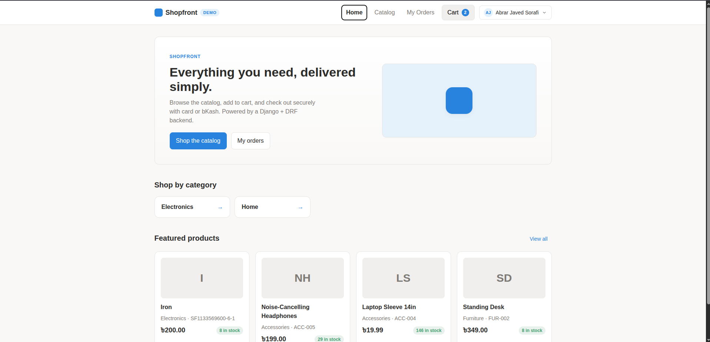
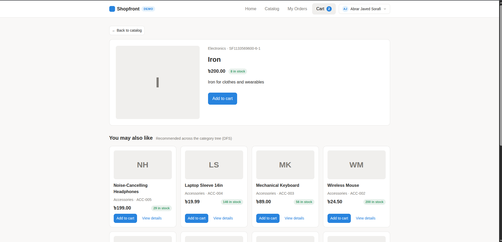
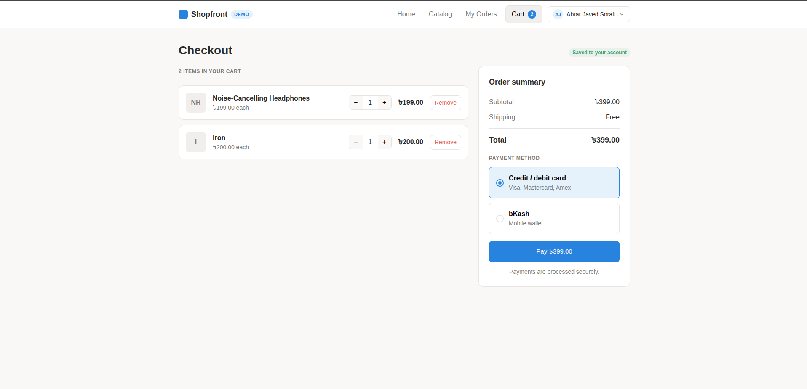
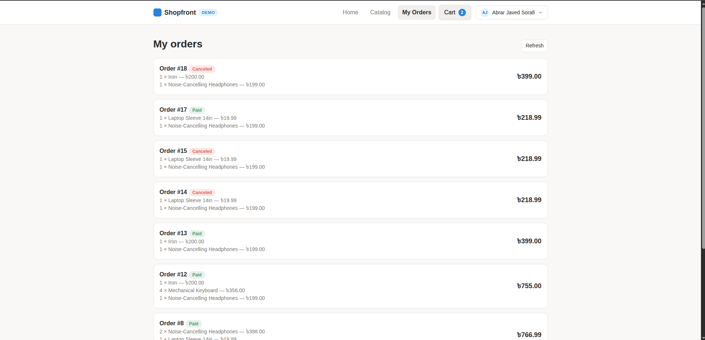
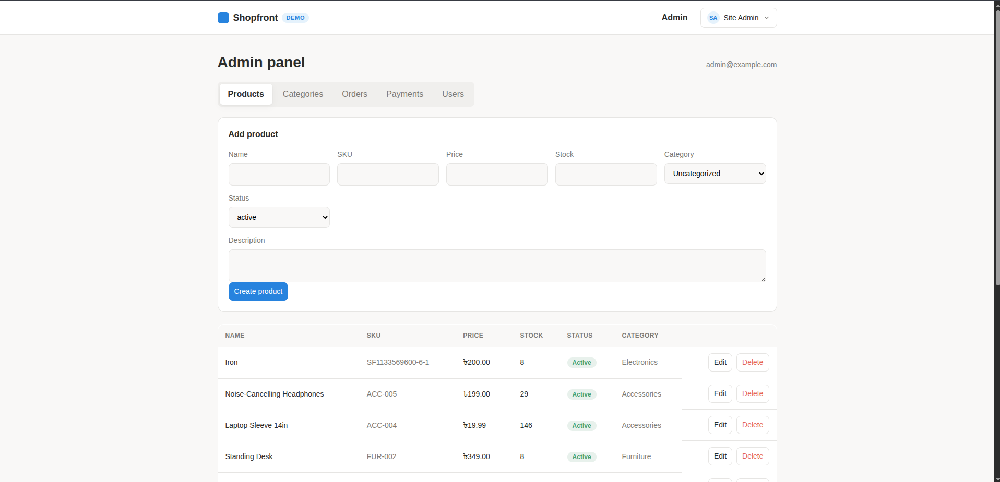
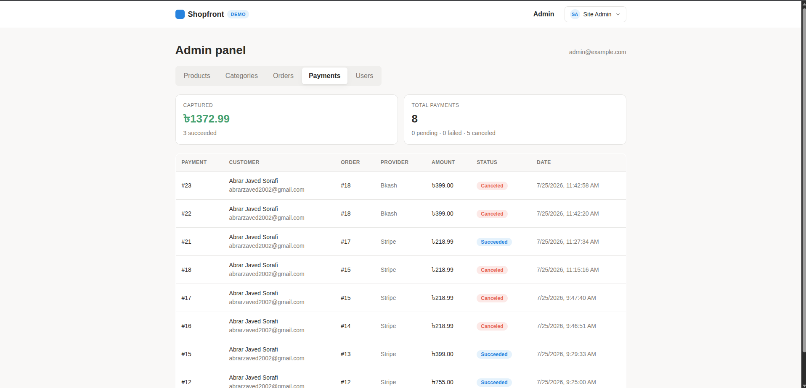

# E-commerce Ordering & Payment System (Backend)

A Django REST Framework backend for an e-commerce ordering and payment platform. It exposes an API-only service for catalog browsing with hierarchical categories, cart and order management, concurrency-safe stock handling, and payment processing. Payments are built on the Strategy pattern with Stripe and bKash support, and product recommendations are derived from a depth-first traversal of the category tree cached in Redis.

---

# Project Overview

**What the project is**

An API-only backend for an online store. It provides email-based JWT authentication, a product catalog organized under a self-referential category tree, a cart, orders with deterministic totals, and a pluggable payment layer. Stock is only reduced once a payment succeeds, and all writes that touch stock run inside atomic, row-locked transactions to prevent overselling. The service ships with an OpenAPI schema (Swagger UI / ReDoc), Celery-based async processing, and a Docker Compose setup (Postgres, Redis, web, worker).

**How the product recommendations work**

- Categories form a self-referential tree (each `Category` has an optional `parent`).
- For a given product, the engine runs an explicit-stack **depth-first search (DFS)** over that product's category and all of its descendant categories to collect the relevant subtree of category IDs.
- It then gathers **active, in-stock** products from those categories (excluding the product itself) and ranks them by DFS proximity (how close the category is in the traversal) and then by recency.
- The full nested category tree is built with a single query plus DFS assembly and cached in **Redis** with a TTL; the cache is invalidated automatically on any category write via Django signals.
- Exposed through `GET /api/v1/products/{id}/recommendations/`.

**How the payment systems are integrated**

- Payments use the **Strategy pattern**. An abstract `PaymentStrategy` defines four methods: `initiate`, `confirm`, `verify`, and `parse_webhook`, each returning a normalized `PaymentResult` mapped to a shared `PaymentStatus` enum (`initiated`, `pending`, `succeeded`, `failed`, `canceled`).
- `StripeStrategy` creates a hosted Checkout Session and returns a redirect URL; success is confirmed via the Stripe webhook (or a status re-check).
- `BkashStrategy` uses tokenized-checkout **create** (returns a redirect URL), **execute** (confirm), and **status** (verify), plus a signature-verified webhook.
- A registry maps each provider string to its strategy class. `PaymentService(provider)` looks up the strategy and drives the order state machine **without any provider-specific branching** in the orchestration code.
- When provider credentials are absent, a built-in **simulation mode** (`PAYMENTS_FAKE`) lets the full checkout flow run end-to-end without real Stripe/bKash accounts.

**How to integrate more payment systems**

Adding a provider (e.g. PayPal) requires no changes to the orders or payment orchestration logic:

1. Add the provider to the `PaymentProvider` choices in `apps/payments/models.py`.
2. Create a strategy class in `apps/payments/strategies/` that subclasses `PaymentStrategy` and implements `initiate`, `confirm`, `verify`, and `parse_webhook`.
3. Register it with a single entry in the `_REGISTRY` dictionary in `apps/payments/strategies/__init__.py`.

The new provider is then available through the same `/api/v1/payments/` endpoints and webhooks.

---

# Screenshots

---

# Features

- Email-based JWT authentication with a custom user model (SimpleJWT).
- Product catalog with filtering, search, ordering, and pagination.
- Hierarchical categories with a nested category tree cached in Redis and invalidated on writes via signals.
- DFS-based product recommendations over the category subtree.
- Cart and order management with deterministic total calculation.
- Concurrency-safe stock reduction using `select_for_update` inside atomic transactions; stock is reduced only after a payment succeeds.
- Pluggable payments via the Strategy pattern with a provider registry (Stripe + bKash).
- Payment lifecycle: initiate, confirm, verify, and signature-verified provider webhooks.
- Simulation mode to run the full payment flow without real provider credentials.
- Consistent error envelope for domain and validation errors.
- Asynchronous processing with Celery and Redis.
- OpenAPI schema with Swagger UI and ReDoc (drf-spectacular).
- Seed commands for an admin user and sample products.
- Dockerized stack (Postgres, Redis, web, Celery worker) and a pytest test suite.

---

# Project Structure

~~~text
ecommerce-backend/
├── apps/
│   ├── core/                 # Base models, exceptions, pagination, permissions
│   ├── users/                # Custom email-based user, registration, JWT login
│   ├── products/             # Product & Category tree, DFS + Redis recommendations
│   ├── cart/                 # Cart and cart items
│   ├── orders/               # Order, OrderItem, totals, stock reduction
│   └── payments/
│       ├── strategies/       # PaymentStrategy ABC + Stripe/bKash + registry
│       │   ├── base.py
│       │   ├── stripe.py
│       │   └── bkash.py
│       ├── webhooks/         # Provider-facing webhook endpoints
│       ├── service.py        # PaymentService (runtime strategy selection)
│       ├── models.py
│       ├── serializers.py
│       ├── tasks.py          # Celery tasks
│       └── urls.py
├── config/                   # settings.py, urls.py, celery.py, wsgi.py, asgi.py
├── docs/                     # architecture.md, erd.md, payment-flows.md
├── seeders/                  # seed_admin & seed_products management commands
├── tests/                    # Unit, API, checkout, and webhook tests
├── docker-compose.yml
├── Dockerfile
├── entrypoint.sh
├── manage.py
├── pytest.ini
├── requirements.txt
└── README.md
~~~

---

# Getting Started

## Prerequisites

- Docker and Docker Compose (recommended), **or**
- Python 3.12, with PostgreSQL and Redis available for a local run.

## Run with Docker (recommended)

~~~bash
# 1. Create a .env file in the project root (see Environment variables below)
# 2. Build and start Postgres, Redis, the web app, and a Celery worker
docker compose up --build
~~~

On first boot the web container runs migrations and seeds an admin user plus sample products.

- API root: https://spoils-traction-attendant.ngrok-free.dev/api/v1/
- Swagger UI: https://spoils-traction-attendant.ngrok-free.dev/api/docs/
- ReDoc: https://spoils-traction-attendant.ngrok-free.dev/api/redoc/
- OpenAPI schema: https://spoils-traction-attendant.ngrok-free.dev/api/schema/
- Health check: https://spoils-traction-attendant.ngrok-free.dev/api/health/
- Django admin: https://spoils-traction-attendant.ngrok-free.dev/admin/  (`admin@example.com` / `admin12345`)

## Run locally (without Docker)

~~~bash
python -m venv .venv && source .venv/bin/activate
pip install -r requirements.txt

# Minimal local setup: SQLite + in-memory cache + inline Celery tasks
export DATABASE_URL=sqlite:///db.sqlite3
export USE_LOCMEM_CACHE=True
export CELERY_TASK_ALWAYS_EAGER=True
export DJANGO_DEBUG=True

python manage.py makemigrations users products cart orders payments
python manage.py migrate
python manage.py seed_admin
python manage.py seed_products
python manage.py runserver
~~~

## Environment variables

Configuration is read from environment variables (via `django-environ`), typically from a `.env` file in the project root. Secrets are never committed.

| Variable | Purpose | Default |
|---|---|---|
| `DJANGO_SECRET_KEY` | Django secret key | `insecure-change-me-in-production` |
| `DJANGO_DEBUG` | Enable debug mode | `False` |
| `DJANGO_ALLOWED_HOSTS` | Comma-separated allowed hosts | `localhost,127.0.0.1` |
| `DATABASE_URL` | Database DSN (Postgres or SQLite) | Postgres (Docker) |
| `REDIS_URL` | Cache + Celery broker URL | `redis://localhost:6379/0` |
| `USE_LOCMEM_CACHE` | Use in-memory cache instead of Redis | `DEBUG` |
| `CELERY_TASK_ALWAYS_EAGER` | Run Celery tasks inline (no worker) | `DEBUG` |
| `PAYMENTS_FAKE` | Simulate providers without real credentials | `DEBUG` |
| `JWT_ACCESS_MINUTES` | Access-token lifetime (minutes) | `60` |
| `JWT_REFRESH_DAYS` | Refresh-token lifetime (days) | `7` |
| `STRIPE_API_KEY` | Stripe secret key | empty |
| `STRIPE_WEBHOOK_SECRET` | Stripe webhook signing secret | empty |
| `STRIPE_CURRENCY` | Stripe currency | `usd` |
| `FRONTEND_BASE_URL` | Base URL for payment return redirects | `http://localhost:3000` |
| `BKASH_BASE_URL` | bKash API base URL | sandbox URL |
| `BKASH_APP_KEY` / `BKASH_APP_SECRET` | bKash app credentials | empty |
| `BKASH_USERNAME` / `BKASH_PASSWORD` | bKash API credentials | empty |
| `BKASH_WEBHOOK_SECRET` | bKash webhook signing secret | empty |

## Running tests

~~~bash
pytest
~~~

The suite covers order and subtotal calculation, stock reduction, DFS traversal and recommendations, category-tree structure, authentication and ownership scoping, order creation, the full checkout flow, and Stripe/bKash webhook handling.