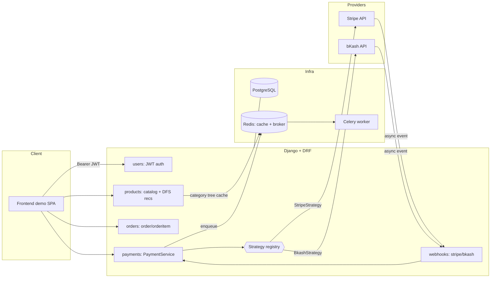

# Architecture Overview

## Layers
- **Views / Serializers**: HTTP + validation only. No business logic.
- **Services** (`orders/services.py`, `payments/service.py`): transactional business logic.
- **Strategies** (`payments/strategies/`): provider-specific integrations behind one interface.
- **Models**: persistence + deterministic domain methods (e.g. `Order.calculate_total`).

## Key design decisions
1. **Strategy pattern for payments** — `PaymentService` resolves a strategy from a registry keyed by `provider`. No provider `if/else` anywhere in order/payment orchestration. Adding a third provider = new class + one registry line.
2. **DFS + Redis for recommendations** — the category tree is built once via DFS and cached in Redis; category writes invalidate it via signals.
3. **Safe stock reduction** — `select_for_update()` inside an atomic transaction prevents oversell under concurrency; stock drops only after payment success.
4. **Idempotent payment state machine** — order transitions to paid + stock reduces exactly once, even if a webhook is delivered multiple times.
