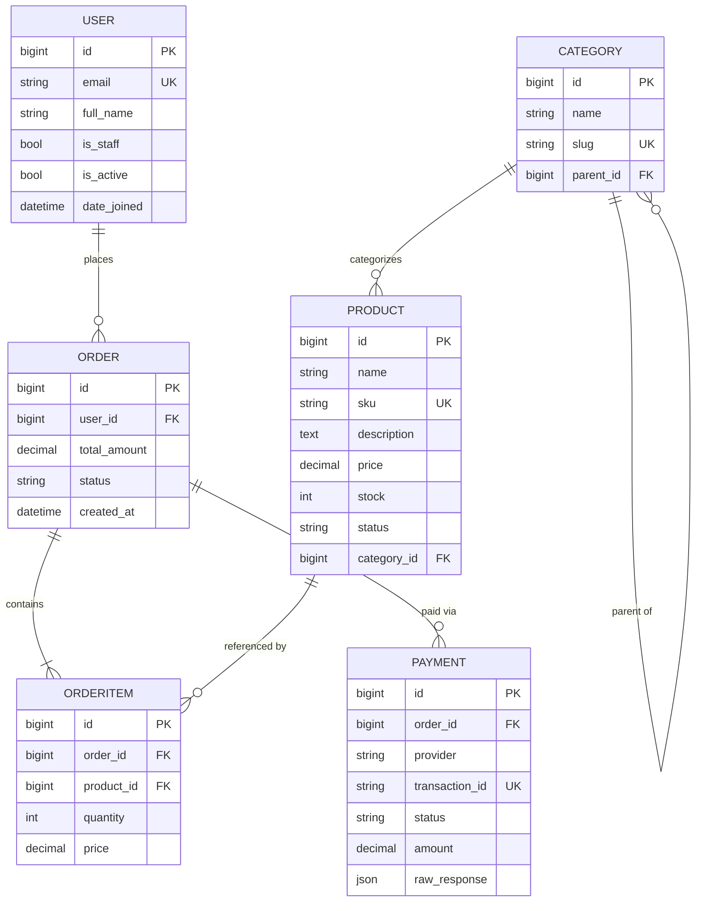

# Entity Relationship Diagram

## Notes
- `Category.parent_id` is a self-referential FK enabling an arbitrary-depth tree.
- `OrderItem.price` is snapshotted at order time (immune to later product price edits).
- `OrderItem` has a unique `(order, product)` constraint; combine quantities instead of duplicate rows.
- `Payment.transaction_id` is unique per provider reference, enabling idempotent webhook lookups.
