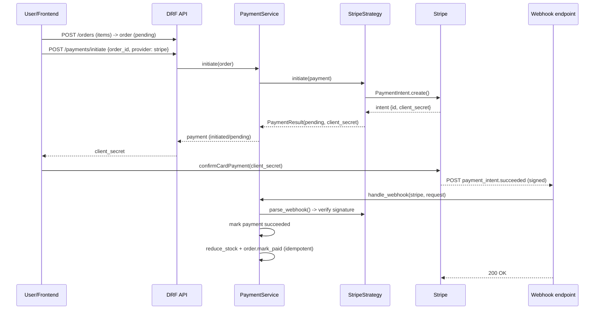
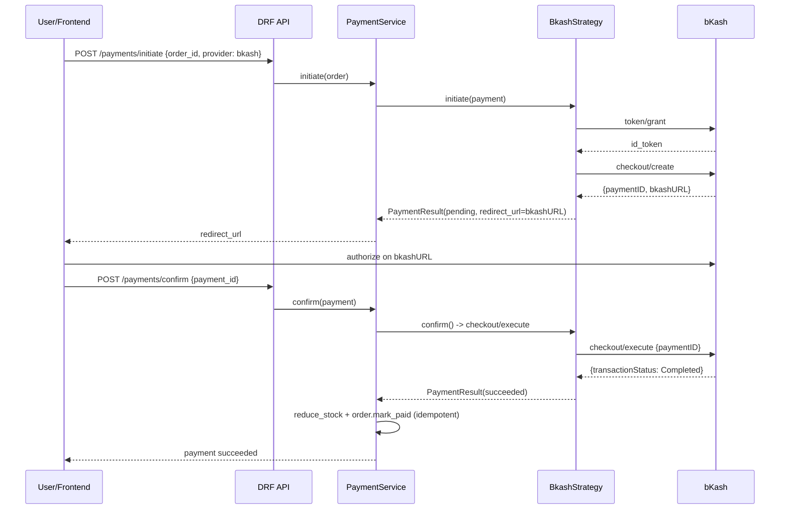

# Payment Flow Sequence Diagrams

## Stripe (PaymentIntent + webhook)

```mermaid
sequenceDiagram
    participant U as User/Frontend
    participant API as DRF API
    participant PS as PaymentService
    participant S as StripeStrategy
    participant ST as Stripe
    participant WH as Webhook endpoint

    U->>API: POST /orders (items) -> order (pending)
    U->>API: POST /payments/initiate {order_id, provider: stripe}
    API->>PS: initiate(order)
    PS->>S: initiate(payment)
    S->>ST: PaymentIntent.create()
    ST-->>S: intent {id, client_secret}
    S-->>PS: PaymentResult(pending, client_secret)
    PS-->>API: payment (initiated/pending)
    API-->>U: client_secret
    U->>ST: confirmCardPayment(client_secret)
    ST-->>WH: POST payment_intent.succeeded (signed)
    WH->>PS: handle_webhook(stripe, request)
    PS->>S: parse_webhook() -> verify signature
    PS->>PS: mark payment succeeded
    PS->>PS: reduce_stock + order.mark_paid (idempotent)
    WH-->>ST: 200 OK
```

## bKash (tokenized checkout + execute)

```mermaid
sequenceDiagram
    participant U as User/Frontend
    participant API as DRF API
    participant PS as PaymentService
    participant B as BkashStrategy
    participant BK as bKash

    U->>API: POST /payments/initiate {order_id, provider: bkash}
    API->>PS: initiate(order)
    PS->>B: initiate(payment)
    B->>BK: token/grant
    BK-->>B: id_token
    B->>BK: checkout/create
    BK-->>B: {paymentID, bkashURL}
    B-->>PS: PaymentResult(pending, redirect_url=bkashURL)
    PS-->>U: redirect_url
    U->>BK: authorize on bkashURL
    U->>API: POST /payments/confirm {payment_id}
    API->>PS: confirm(payment)
    PS->>B: confirm() -> checkout/execute
    B->>BK: checkout/execute {paymentID}
    BK-->>B: {transactionStatus: Completed}
    B-->>PS: PaymentResult(succeeded)
    PS->>PS: reduce_stock + order.mark_paid (idempotent)
    PS-->>U: payment succeeded
```
